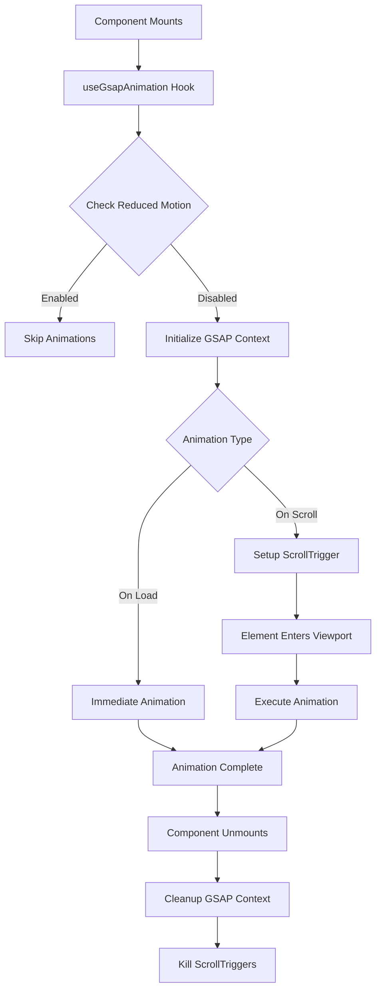

# Design Document: Homepage GSAP Animations

## Overview

This design implements a comprehensive GSAP-based animation system for a Next.js 14+ TypeScript application. The system provides reusable hooks, utilities, and component integrations that deliver premium, performant animations across 10 homepage sections while maintaining accessibility standards and mobile responsiveness.

The architecture follows React best practices with proper cleanup, TypeScript type safety, and performance optimization through GPU-accelerated properties. The design emphasizes developer experience with clear APIs, centralized configuration, and comprehensive error handling.

## Architecture

### High-Level Structure

```
src/
├── hooks/
│   └── useGsapAnimation.ts          # Core GSAP lifecycle hook
├── utils/
│   └── animations/
│       ├── index.ts                 # Public API exports
│       ├── config.ts                # Timing, easing, and configuration constants
│       ├── accessibility.ts         # Reduced motion detection
│       ├── patterns.ts              # Reusable animation patterns
│       └── scrollTrigger.ts         # ScrollTrigger utilities
└── components/
    └── home/
        ├── Hero.tsx                 # Updated with animations
        ├── SolutionsOverview.tsx    # Updated with animations
        ├── Process.tsx              # Updated with animations
        ├── Team.tsx                 # Updated with animations
        ├── Reviews.tsx              # Updated with animations
        ├── HoustonNuances.tsx       # Updated with animations
        ├── LocalAreas.tsx           # Updated with animations
        ├── Resources.tsx            # Updated with animations
        ├── LocationMap.tsx          # Updated with animations
        └── FinalCta.tsx             # Updated with animations
```

### Animation Flow



### Technology Stack

- **GSAP 3.12+**: Core animation library
- **ScrollTrigger Plugin**: Scroll-based animation triggers
- **React 18+**: Component framework
- **TypeScript 5+**: Type safety
- **Next.js 14+**: Application framework

## Components and Interfaces

### Core Hook: useGsapAnimation

The central hook that manages GSAP lifecycle, cleanup, and accessibility.

```typescript
interface UseGsapAnimationOptions {
  disabled?: boolean;
  scope?: RefObject<HTMLElement>;
}

interface UseGsapAnimationReturn {
  gsapContext: gsap.Context | null;
  isReducedMotion: boolean;
  animate: (target: gsap.TweenTarget, vars: gsap.TweenVars) => gsap.core.Tween | null;
  animateStagger: (targets: gsap.TweenTarget, vars: gsap.TweenVars, stagger: number) => gsap.core.Timeline | null;
}

function useGsapAnimation(options?: UseGsapAnimationOptions): UseGsapAnimationReturn
```

**Behavior:**
- Creates a GSAP context scoped to the component
- Detects `prefers-reduced-motion` media query
- Returns animation helpers that respect reduced motion
- Automatically cleans up on unmount

**Implementation Notes:**
- Use `gsap.context()` for automatic cleanup
- Store ScrollTrigger instances for manual cleanup
- Return null from animation functions when reduced motion is enabled

### Animation Configuration

Centralized constants for consistent timing and easing across the application.

```typescript
// config.ts
export const ANIMATION_DURATION = {
  FAST: 0.3,
  MEDIUM: 0.6,
  SLOW: 1.0,
  HERO: 1.2,
} as const;

export const STAGGER_DELAY = {
  TIGHT: 0.1,
  MEDIUM: 0.15,
  LOOSE: 0.2,
} as const;

export const EASING = {
  DEFAULT: 'power2.out',
  SMOOTH: 'power1.inOut',
  HERO: 'power3.out',
  BOUNCE: 'back.out(1.2)',
} as const;

export const SCROLL_TRIGGER_DEFAULTS = {
  start: 'top 80%',
  toggleActions: 'play none none none',
  markers: process.env.NODE_ENV === 'development',
} as const;

export const MOBILE_BREAKPOINT = 768;
export const MOBILE_DURATION_MULTIPLIER = 0.7;
export const MOBILE_STAGGER_MULTIPLIER = 0.6;
```

### Accessibility Utilities

```typescript
// accessibility.ts
export function checkReducedMotion(): boolean {
  if (typeof window === 'undefined') return false;
  return window.matchMedia('(prefers-reduced-motion: reduce)').matches;
}

export function watchReducedMotion(callback: (isReduced: boolean) => void): () => void {
  if (typeof window === 'undefined') return () => {};
  
  const mediaQuery = window.matchMedia('(prefers-reduced-motion: reduce)');
  const handler = (e: MediaQueryListEvent) => callback(e.matches);
  
  mediaQuery.addEventListener('change', handler);
  return () => mediaQuery.removeEventListener('change', handler);
}

export function getAnimationDuration(baseDuration: number, isReducedMotion: boolean): number {
  return isReducedMotion ? 0 : baseDuration;
}
```

### Animation Patterns

Reusable animation pattern functions that encapsulate common animation behaviors.

```typescript
// patterns.ts
export interface FadeInOptions {
  duration?: number;
  delay?: number;
  ease?: string;
  y?: number;
  x?: number;
  scale?: number;
}

export function fadeIn(
  target: gsap.TweenTarget,
  options: FadeInOptions = {}
): gsap.TweenVars {
  const {
    duration = ANIMATION_DURATION.MEDIUM,
    delay = 0,
    ease = EASING.DEFAULT,
    y = 0,
    x = 0,
    scale = 1,
  } = options;

  return {
    opacity: 0,
    y: y !== 0 ? y : undefined,
    x: x !== 0 ? x : undefined,
    scale: scale !== 1 ? scale : undefined,
    duration,
    delay,
    ease,
    onComplete: () => {
      // Remove will-change after animation
      gsap.set(target, { clearProps: 'willChange' });
    },
  };
}

export interface StaggerRevealOptions extends FadeInOptions {
  stagger?: number;
}

export function staggerReveal(
  targets: gsap.TweenTarget,
  options: StaggerRevealOptions = {}
): gsap.TweenVars {
  const { stagger = STAGGER_DELAY.MEDIUM, ...fadeOptions } = options;
  
  return {
    ...fadeIn(targets, fadeOptions),
    stagger,
  };
}

export function slideInFromRight(
  target: gsap.TweenTarget,
  options: FadeInOptions = {}
): gsap.TweenVars {
  return fadeIn(target, { ...options, x: 100 });
}

export function slideInFromLeft(
  target: gsap.TweenTarget,
  options: FadeInOptions = {}
): gsap.TweenVars {
  return fadeIn(target, { ...options, x: -100 });
}

export function slideInFromBottom(
  target: gsap.TweenTarget,
  options: FadeInOptions = {}
): gsap.TweenVars {
  return fadeIn(target, { ...options, y: 50 });
}

export function scaleIn(
  target: gsap.TweenTarget,
  options: FadeInOptions = {}
): gsap.TweenVars {
  return fadeIn(target, { ...options, scale: 0.95 });
}
```

### ScrollTrigger Utilities

```typescript
// scrollTrigger.ts
export interface CreateScrollTriggerOptions {
  trigger: Element | string;
  start?: string;
  end?: string;
  scrub?: boolean | number;
  pin?: boolean;
  markers?: boolean;
  onEnter?: () => void;
  onLeave?: () => void;
}

export function createScrollTrigger(
  animation: gsap.core.Timeline | gsap.core.Tween,
  options: CreateScrollTriggerOptions
): ScrollTrigger {
  return ScrollTrigger.create({
    ...SCROLL_TRIGGER_DEFAULTS,
    ...options,
    animation,
  });
}

export function createParallax(
  element: Element | string,
  speed: number = 0.5
): ScrollTrigger {
  return ScrollTrigger.create({
    trigger: element,
    start: 'top bottom',
    end: 'bottom top',
    scrub: true,
    onUpdate: (self) => {
      const y = self.progress * 100 * speed;
      gsap.set(element, { yPercent: y });
    },
  });
}

export function isMobile(): boolean {
  if (typeof window === 'undefined') return false;
  return window.innerWidth < MOBILE_BREAKPOINT;
}

export function getResponsiveDuration(baseDuration: number): number {
  return isMobile() ? baseDuration * MOBILE_DURATION_MULTIPLIER : baseDuration;
}

export function getResponsiveStagger(baseStagger: number): number {
  return isMobile() ? baseStagger * MOBILE_STAGGER_MULTIPLIER : baseStagger;
}
```

## Data Models

### Animation Configuration Types

```typescript
// types.ts
export interface AnimationConfig {
  duration: number;
  delay?: number;
  ease: string;
  stagger?: number;
}

export interface ScrollAnimationConfig extends AnimationConfig {
  trigger: string | Element;
  start?: string;
  end?: string;
  scrub?: boolean | number;
}

export interface HoverAnimationConfig {
  scale?: number;
  y?: number;
  duration: number;
  ease: string;
}

export type AnimationTarget = Element | Element[] | string | null;

export interface AnimationContext {
  gsap: typeof gsap;
  ScrollTrigger: typeof ScrollTrigger;
  isReducedMotion: boolean;
  isMobile: boolean;
}
```

### Component Animation State

Each animated component maintains refs for animated elements:

```typescript
interface AnimatedComponentRefs {
  containerRef: RefObject<HTMLElement>;
  itemRefs: RefObject<HTMLElement[]>;
  triggerRef?: RefObject<HTMLElement>;
}
```

## Component Integration Patterns

### Pattern 1: On-Load Animation (Hero Section)

```typescript
'use client';

import { useRef, useEffect } from 'react';
import { useGsapAnimation } from '@/hooks/useGsapAnimation';
import { ANIMATION_DURATION, EASING, STAGGER_DELAY } from '@/utils/animations/config';
import gsap from 'gsap';

export function Hero() {
  const containerRef = useRef<HTMLDivElement>(null);
  const headlineRef = useRef<HTMLHeadingElement>(null);
  const subheadlineRef = useRef<HTMLParagraphElement>(null);
  const memoCardRef = useRef<HTMLDivElement>(null);
  const skylineRef = useRef<HTMLDivElement>(null);
  
  const { gsapContext, isReducedMotion } = useGsapAnimation({ scope: containerRef });

  useEffect(() => {
    if (!gsapContext || isReducedMotion) return;

    const ctx = gsapContext;
    
    ctx.add(() => {
      const tl = gsap.timeline();
      
      // Headline staggered reveal
      if (headlineRef.current) {
        const chars = headlineRef.current.querySelectorAll('.char');
        tl.from(chars, {
          opacity: 0,
          y: 20,
          duration: ANIMATION_DURATION.SLOW,
          ease: EASING.HERO,
          stagger: 0.03,
        });
      }
      
      // Subheadline fade in
      if (subheadlineRef.current) {
        tl.from(subheadlineRef.current, {
          opacity: 0,
          y: 20,
          duration: ANIMATION_DURATION.MEDIUM,
          ease: EASING.DEFAULT,
        }, '-=0.6');
      }
      
      // Memo card slide in
      if (memoCardRef.current) {
        tl.from(memoCardRef.current, {
          opacity: 0,
          x: 100,
          duration: ANIMATION_DURATION.HERO,
          ease: EASING.HERO,
        }, '-=0.4');
      }
      
      // Parallax for skyline
      if (skylineRef.current) {
        gsap.to(skylineRef.current, {
          yPercent: 50,
          ease: 'none',
          scrollTrigger: {
            trigger: containerRef.current,
            start: 'top top',
            end: 'bottom top',
            scrub: true,
          },
        });
      }
    });

    return () => ctx.revert();
  }, [gsapContext, isReducedMotion]);

  return (
    <div ref={containerRef}>
      <div ref={skylineRef} className="skyline-background">
        {/* Skyline content */}
      </div>
      <h1 ref={headlineRef}>
        {/* Split into chars for stagger */}
      </h1>
      <p ref={subheadlineRef}>
        {/* Subheadline */}
      </p>
      <div ref={memoCardRef}>
        {/* Memo card */}
      </div>
    </div>
  );
}
```

### Pattern 2: Scroll-Triggered Animation (Solutions Overview)

```typescript
'use client';

import { useRef, useEffect } from 'react';
import { useGsapAnimation } from '@/hooks/useGsapAnimation';
import { staggerReveal } from '@/utils/animations/patterns';
import { getResponsiveDuration, getResponsiveStagger } from '@/utils/animations/scrollTrigger';
import { ANIMATION_DURATION, STAGGER_DELAY } from '@/utils/animations/config';
import gsap from 'gsap';

export function SolutionsOverview() {
  const containerRef = useRef<HTMLDivElement>(null);
  const cardsRef = useRef<HTMLDivElement[]>([]);
  
  const { gsapContext, isReducedMotion } = useGsapAnimation({ scope: containerRef });

  useEffect(() => {
    if (!gsapContext || isReducedMotion) return;

    const ctx = gsapContext;
    
    ctx.add(() => {
      if (cardsRef.current.length === 0) return;
      
      gsap.from(cardsRef.current, {
        ...staggerReveal(cardsRef.current, {
          duration: getResponsiveDuration(ANIMATION_DURATION.MEDIUM),
          stagger: getResponsiveStagger(STAGGER_DELAY.MEDIUM),
          y: 50,
        }),
        scrollTrigger: {
          trigger: containerRef.current,
          start: 'top 80%',
        },
      });
    });

    return () => ctx.revert();
  }, [gsapContext, isReducedMotion]);

  return (
    <div ref={containerRef}>
      {loanOptions.map((option, index) => (
        <div
          key={option.id}
          ref={(el) => {
            if (el) cardsRef.current[index] = el;
          }}
          className="loan-card"
        >
          {/* Card content */}
        </div>
      ))}
    </div>
  );
}
```

### Pattern 3: Hover Animations

```typescript
'use client';

import { useRef } from 'react';
import { useGsapAnimation } from '@/hooks/useGsapAnimation';
import { ANIMATION_DURATION, EASING } from '@/utils/animations/config';
import gsap from 'gsap';

export function TeamCard({ member }: { member: TeamMember }) {
  const cardRef = useRef<HTMLDivElement>(null);
  const { isReducedMotion } = useGsapAnimation();

  const handleMouseEnter = () => {
    if (isReducedMotion || !cardRef.current) return;
    
    gsap.to(cardRef.current, {
      y: -4,
      scale: 1.02,
      duration: ANIMATION_DURATION.FAST,
      ease: EASING.DEFAULT,
    });
  };

  const handleMouseLeave = () => {
    if (isReducedMotion || !cardRef.current) return;
    
    gsap.to(cardRef.current, {
      y: 0,
      scale: 1,
      duration: ANIMATION_DURATION.FAST,
      ease: EASING.DEFAULT,
    });
  };

  return (
    <div
      ref={cardRef}
      onMouseEnter={handleMouseEnter}
      onMouseLeave={handleMouseLeave}
      className="team-card"
    >
      {/* Card content */}
    </div>
  );
}
```

